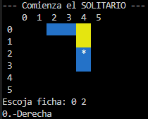
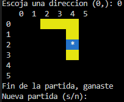

# Peg Solitaire

A command-line version of the classic Peg Solitaire game implemented in C++. Play the game on your terminal!

## Requirements

- **Operating System**: macOS, Windows, or Linux
- **Compiler**: `g++` (example: MinGW for Windows)
- **Build Tool**: `make` installed

## Build Instructions

### To compile the game, run the following command in your terminal:
```console
make
```
### Run the .exe if you are on windows
```console
main.exe
```
### Play!
<p align="center">
  
  
  
  
</p>